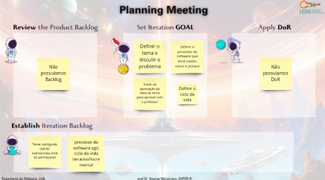
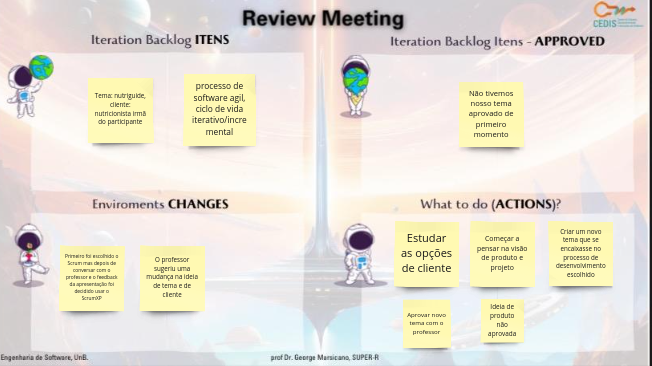
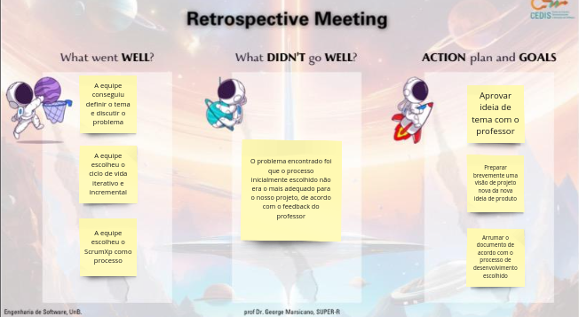
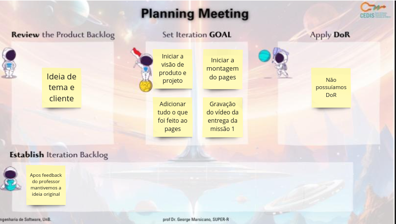
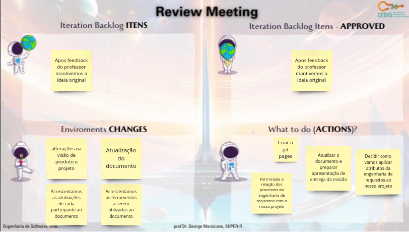
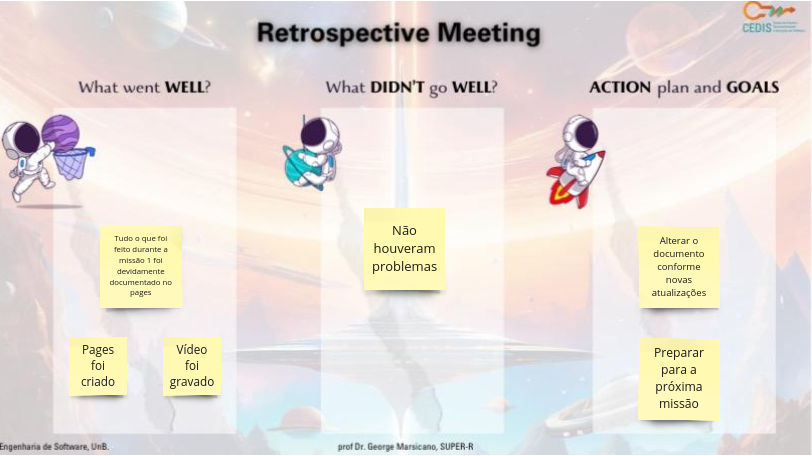

# Documentação das Sprints da missão 1

## Sprints

### **Missão 1 - 05/09 a 28/09**

A tabela 1 apresenta o Planejamento da missão 1

_tabela 1_ Planejamento da missão 1

| Data Início | Sprint  | Data Final |
|-------------|---------|------------|
| 05/09       | Sprint 1| 12/09      |
| 13/09       | Sprint 2| 28/09      |

Fonte: [Eric Camargo](https://github.com/Ericcs10), 2023.

### Sprint 1 

A tabela 2 apresenta o que foi feito na sprint 1

_tabela 2_ Sprint 1

Data: 05/09 a 12/09

| Cerimônia                   | Atividades da Sprint       |
|-----------------------------|---------------------------|
| Sprint Planning             | Definir o tema e discutir o problema,  |
| Backlog da Sprint           | Cada participante, sugerir um tema e cliente para ser votado |
| Sprint Review               | Após definido o tema, e os processos de engenharia de software, O professor sugeriu uma mudança na ideia de tema e de cliente, tivemos que pensar em outro tema para aprovar com o professor, e começar a fazer a visão de produto e projeto de ambas as ideias |
| Débitos                     | Aprovar ideia de tema e cliente (antiga ou nova)|
| Sprint Retrospective        | O problema encontrado foi que o processo inicialmente escolhido não era o mais adequado para o nosso projeto, de acordo com o feedback do professor, foram escolhidos o processo e o ciclo de vida, |

Fonte: [Eric Camargo](https://github.com/Ericcs10), 2023.

### Dailys da sprint

A tabela 3 apresenta o registros das dailys

_tabela 3_ Dailys realizadas

| Data    | Aluno     | O que foi feito                                         | O que vai ser feito                                      | Bloqueios                                               |
|---------|-----------|---------------------------------------------------------|------------------------------------------------------------|---------------------------------------------------------|
| 05/09   | Luana     |                                                         |                                                            |                                                          |
| 05/09   | Henrique  |                                                         |                                                            |                                                          |
| 05/09   | Eric      |                                                         |                                                            |                                                          |
| 05/09   | Guilherme |                                                         |                                                            |                                                          |
| 06/09   | Luana     |                                                         |                                                            |                                                          |
| 06/09   | Henrique  |                                                         |                                                            |                                                          |
| 06/09   | Eric      |                                                         |                                                            |                                                          |
| 06/09   | Guilherme |                                                         |                                                            |                                                          |
| 11/09   | Luana     |                                                         |                                                            |                                                          |
| 11/09   | Henrique  |                                                         |                                                            |                                                          |
| 11/09   | Eric      |                                                         |                                                            |                                                          |
| 11/09   | Guilherme |                                                         |                                                            |                                                          |
| 12/09   | Luana     |                                                         |                                                            |                                                          |
| 12/09   | Henrique  |                                                         |                                                            |                                                          |
| 12/09   | Eric      |                                                         |                                                            |                                                          |
| 12/09   | Guilherme |                                                         |                                                            |                                                          |

Fonte: [Eric Camargo](https://github.com/Ericcs10), 2023.

### **Planning Meeting**
 
- Template da planning:

  

### **Review Meeting**

- Template da review:

  

### **Retrospective Meeting**

- Template da retrospective:

  

### Sprint 2

A tabela 4 apresenta o que foi feito na Sprint 2

_tabela 4_ Sprint 2

Data: 13/09 a 28/09

| Cerimônia                   | Atividades da Sprint       |
|-----------------------------|---------------------------|
| Sprint Planning             | Iniciar a montagem do pages, Iniciar a visão de produto e projeto, Adicionar tudo o que foi feito ao pages, Gravação do vídeo da entrega da missão 1 |
| Backlog da Sprint           | Apos feedback do professor mantivemos a ideia original |
| Sprint Review               | Acrescentamos as atribuições de cada participante ao documento, Acrescentamos as ferramentas a serem utilizadas ao documento, alterações na visão de produto e projeto, Atualização do documento,Decidir como vamos aplicar atributos da engenharia de requisitos ao nosso projeto, Atualizar o documento e preparar apresentação de entrega da missão |
| Débitos                     | Não adicionamos história da facção ao pages |
| Sprint Retrospective        | Tudo o que foi feito durante a missão 1 foi devidamente documentado no pages, Vídeo foi gravado,  |

Fonte: [Eric Camargo](https://github.com/Ericcs10), 2023.

### Dailys da sprint

A tabela 5 apresenta o registros das dailys

_tabela 5_ Dailys realizadas

| Data    | Aluno     | O que foi feito                                         | O que vai ser feito                                      | Bloqueios                                               |
|---------|-----------|---------------------------------------------------------|------------------------------------------------------------|---------------------------------------------------------|
| 13/09   | Luana     |                                                         |                                                            |                                                          |
| 13/09   | Henrique  |                                                         |                                                            |                                                          |
| 13/09   | Eric      |                                                         |                                                            |                                                          |
| 13/09   | Guilherme |                                                         |                                                            |                                                          |
| 14/09   | Luana     |                                                         |                                                            |                                                          |
| 14/09   | Henrique  |                                                         |                                                            |                                                          |
| 14/09   | Eric      |                                                         |                                                            |                                                          |
| 14/09   | Guilherme |                                                         |                                                            |                                                          |
| 15/09   | Luana     |                                                         |                                                            |                                                          |
| 15/09   | Henrique  |                                                         |                                                            |                                                          |
| 15/09   | Eric      |                                                         |                                                            |                                                          |
| 15/09   | Guilherme |                                                         |                                                            |                                                          |
| 18/09   | Luana     |                                                         |                                                            |                                                          |
| 18/09   | Henrique  |                                                         |                                                            |                                                          |
| 18/09   | Eric      |                                                         |                                                            |                                                          |
| 18/09   | Guilherme |                                                         |                                                            |                                                          |
| 19/09   | Luana     |                                                         |                                                            |                                                          |
| 19/09   | Henrique  |                                                         |                                                            |                                                          |
| 19/09   | Eric      |                                                         |                                                            |                                                          |
| 19/09   | Guilherme |                                                         |                                                            |                                                          |
| 20/09   | Luana     |                                                         |                                                            |                                                          |
| 20/09   | Henrique  |                                                         |                                                            |                                                          |
| 20/09   | Eric      |                                                         |                                                            |                                                          |
| 20/09   | Guilherme |                                                         |                                                            |                                                          |
| 21/09   | Luana     |                                                         |                                                            |                                                          |
| 21/09   | Henrique  |                                                         |                                                            |                                                          |
| 21/09   | Eric      |                                                         |                                                            |                                                          |
| 21/09   | Guilherme |                                                         |                                                            |                                                          |
| 22/09   | Luana     |                                                         |                                                            |                                                          |
| 22/09   | Henrique  |                                                         |                                                            |                                                          |
| 22/09   | Eric      |                                                         |                                                            |                                                          |
| 22/09   | Guilherme |                                                         |                                                            |                                                          |
| 25/09   | Luana     |                                                         |                                                            |                                                          |
| 25/09   | Henrique  |                                                         |                                                            |                                                          |
| 25/09   | Eric      |                                                         |                                                            |                                                          |
| 25/09   | Guilherme |                                                         |                                                            |                                                          |
| 26/09   | Luana     |                                                         |                                                            |                                                          |
| 26/09   | Henrique  |                                                         |                                                            |                                                          |
| 26/09   | Eric      |                                                         |                                                            |                                                          |
| 26/09   | Guilherme |                                                         |                                                            |                                                          |
| 27/09   | Luana     |                                                         |                                                            |                                                          |
| 27/09   | Henrique  |                                                         |                                                            |                                                          |
| 27/09   | Eric      |                                                         |                                                            |                                                          |
| 27/09   | Guilherme |                                                         |                                                            |                                                          |
| 28/09   | Luana     |                                                         |                                                            |                                                          |
| 28/09   | Henrique  |                                                         |                                                            |                                                          |
| 28/09   | Eric      |                                                         |                                                            |                                                          |
| 28/09   | Guilherme |                                                         |                                                            |                                                          |

Fonte: [Eric Camargo](https://github.com/Ericcs10), 2023.

### **Planning Meeting**
 
- Template da planning:

  

### **Review Meeting**

- Template da review:

  

### **Retrospective Meeting**

- Template da retrospective:

  

## Histórico de versão

| Versão |    Data    |      Descrição       |  Autor  | Revisor |
| :----: | :--------: | :------------------: | :-----: | :-----: |
|  1.0   | 22/11/2023 | Criação da página | [Henrique](https://github.com/henriqtorresl) |   |
|  1.1   | 22/11/2023 | Descrição missão 1| [Eric](https://github.com/Ericcs10) | [Luana Torres](https://github.com/luanatorress)  |