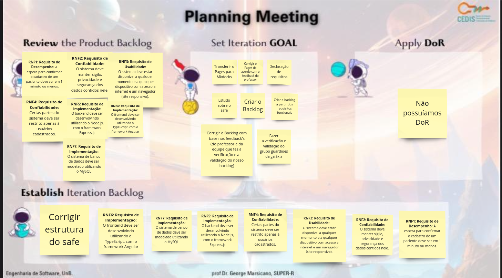
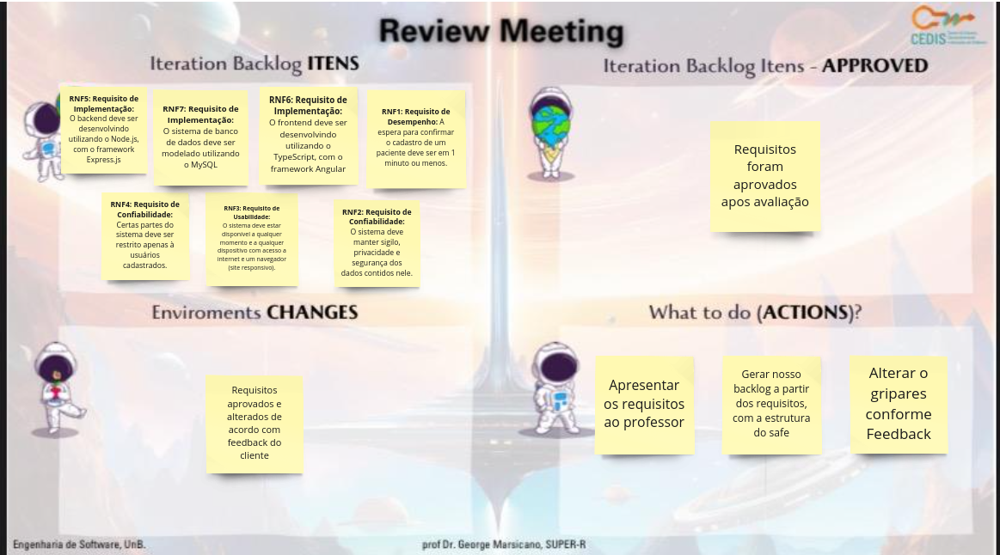
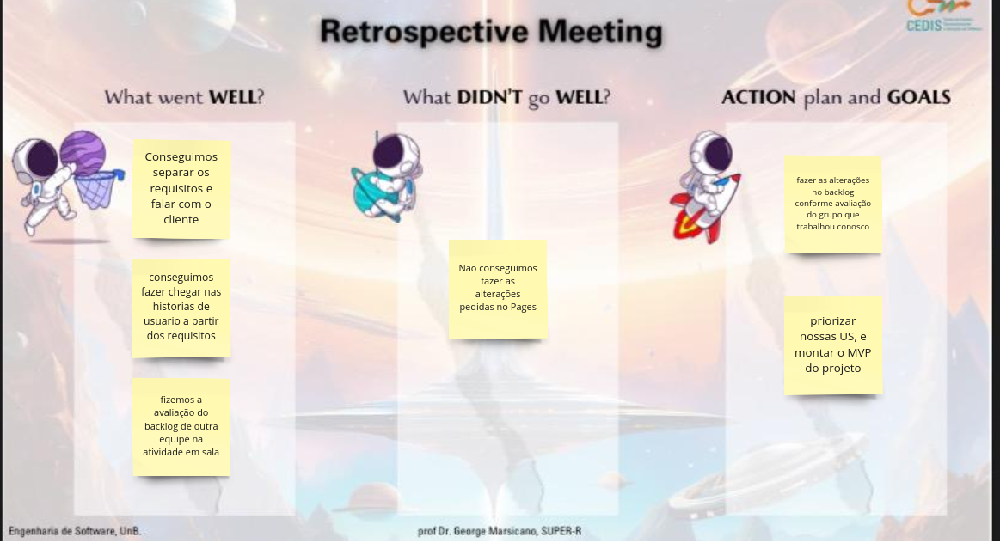
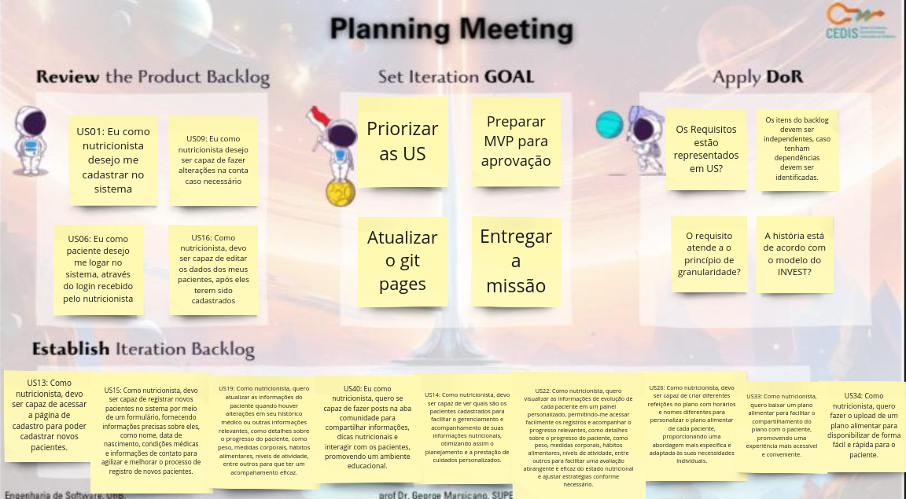
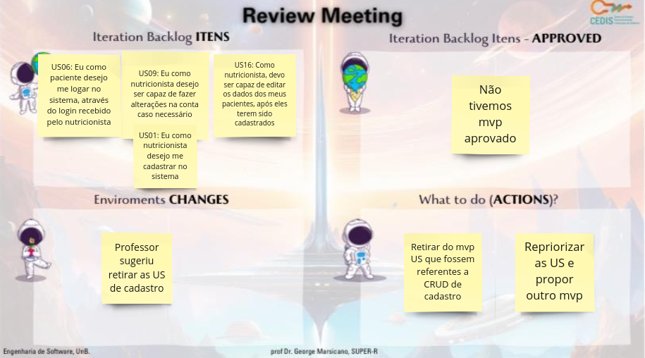
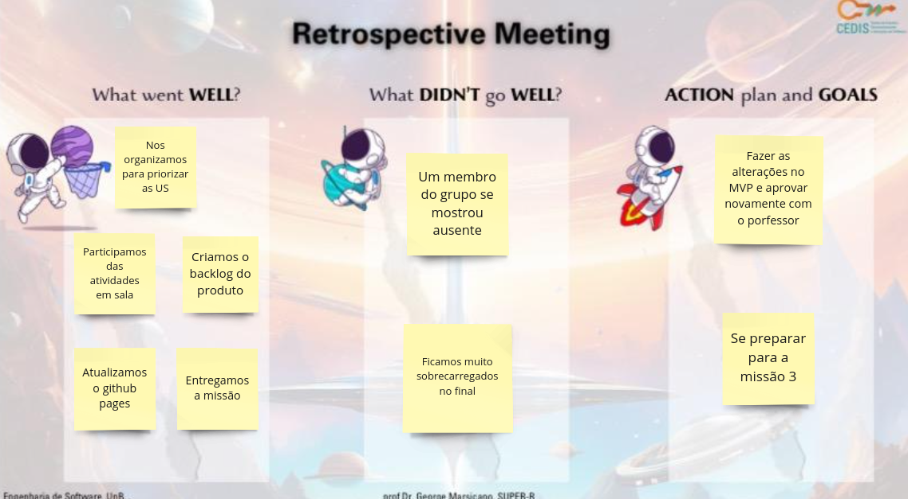

# Documentação das Sprints da missão 2

## Sprints

### **Missão 2 - 03/10 a 26/10**

A tabela 1 apresenta o planejamento da missão 2

_tabela 1_ Planejamento missão 2

| Data Início | Sprint  | Data Final |
|-------------|---------|------------|
| 03/10       | Sprint 3| 17/10      |
| 18/10       | Sprint 4| 26/10      |

Fonte: [Eric Camargo](https://github.com/Ericcs10), 2023.

### Sprint 3 

A tabela 2 apresenta o que foi feito na Sprint 3

_tabela 2_ Sprint 3

Data: 03/10 a 17/10

| Cerimônia                   | Atividades da Sprint       |
|-----------------------------|---------------------------|
| Sprint Planning             | Transferir o Pages para Mkdocks, Corrigir o Pages de acordo com o feedback do professor, Declaração de requisitos, Estudo sobre o safe, Criar o Backlog, Criar o backlog a partir dos requisitos funcionais, Corrigir o Backlog com base nos feedback's (do professor e da equipe que fez a verificação e a validação do nosso backlog), Fazer a verificação e validação do grupo guardioes da galáxia|
| Backlog da Sprint           | Alterar os requisitos não funcionais, RN1, RN2, RN3, RN4, RN5, RN6, RN7 |
| Sprint Review               | Requisitos foram aprovados apos avaliação, Gerar nosso backlog a partir dos requisitos, com a estrutura do safe, Alterar o gitpages conforme Feedback |
| Débitos                     | Não conseguimos fazer as alterações pedidas no Pages |
| Sprint Retrospective        | Conseguimos separar os requisitos e falar com o cliente, conseguimos fazer chegar nas historias de usuario a partir dos requisitos, fizemos a avaliação do backlog de outra equipe na atividade em sala, começamos o backlog |

Fonte: [Eric Camargo](https://github.com/Ericcs10), 2023.

### Dailys da sprint

A tabela 3 apresenta o registros das dailys

_tabela 3_ Dailys realizadas

| Data    | Aluno     | O que foi feito                                         | O que vai ser feito                                      | Bloqueios                                               |
|---------|-----------|---------------------------------------------------------|------------------------------------------------------------|---------------------------------------------------------|
| 03/10   | Luana     |  |     |   |
| 03/10   | Henrique  |  |     |   |
| 03/10   | Eric      |  |     |   |
| 03/10   | Guilherme |  |     |   |
| 04/10   | Luana     |  |     |   |
| 04/10   | Henrique  |  |     |   |
| 04/10   | Eric      |  |     |   |
| 04/10   | Guilherme |  |     |   |
| 05/10   | Luana     |  |     |   |
| 05/10   | Henrique  |  |     |   |
| 05/10   | Eric      |  |     |   |
| 05/10   | Guilherme |  |     |   |
| 06/10   | Luana     |  |     |   |
| 06/10   | Henrique  |  |     |   |
| 06/10   | Eric      |  |     |   |
| 06/10   | Guilherme |  |     |   |
| 09/10   | Luana     |  |     |   |
| 09/10   | Henrique  |  |     |   |
| 09/10   | Eric      |  |     |   |
| 09/10   | Guilherme |  |     |   |
| 10/10   | Luana     |  |     |   |
| 10/10   | Henrique  |  |     |   |
| 10/10   | Eric      |  |     |   |
| 10/10   | Guilherme |  |     |   |
| 11/10   | Luana     |  |     |   |
| 11/10   | Henrique  |  |     |   |
| 11/10   | Eric      |  |     |   |
| 11/10   | Guilherme |  |     |   |
| 16/10   | Luana     |  |     |   |
| 16/10   | Henrique  |  |     |   |
| 16/10   | Eric      |  |     |   |
| 16/10   | Guilherme |  |     |   |
| 17/10   | Luana     |  |     |   |
| 17/10   | Henrique  |  |     |   |
| 17/10   | Eric      |  |     |   |
| 17/10   | Guilherme |  |     |   |

Fonte: [Eric Camargo](https://github.com/Ericcs10), 2023.

### **Planning Meeting**
 
- Template da planning:
 

  

### **Review Meeting**

- Template da review:

  

### **Retrospective Meeting**

- Template da retrospective:

  

### Sprint 4

A tabela 4 apresenta o que foi feito na sprint 4

_tabela 4_ Sprint 4

Data: 18/10 a 26/10

| Cerimônia                   | Atividades da Sprint       |
|-----------------------------|---------------------------|
| Sprint Planning             | Priorizar as US, Preparar MVP para aprovação, Atualizar o git pages, Entregar a missão|
| Backlog da Sprint           | Começamos o MVP, trabalhamos com: US13, US15, US19, US40, US14, US22, US26, US34, US36 |
| Sprint Review               | Professor sugeriu retirar as US de cadastro, Não tivemos mvp aprovado, Retirar do mvp US que fossem referentes a CRUD de cadastro, Repriorizar as US e propor outro mvp |
| Débitos                     | Aprovar MVP |
| Sprint Retrospective        | Nos organizamos para priorizar as US, Participamos das atividades em sala, Criamos o backlog do produto, Atualizamos o github pages, Entregamos a missão |

Fonte: [Eric Camargo](https://github.com/Ericcs10), 2023.

### Dailys da sprint

A tabela 5 apresenta o registros das dailys

_tabela 5_ Dailys realizadas

| Data    | Aluno     | O que foi feito                                         | O que vai ser feito                                      | Bloqueios                                               |
|---------|-----------|---------------------------------------------------------|------------------------------------------------------------|---------------------------------------------------------|
| 18/10   | Luana     |  |     |   |
| 18/10   | Henrique  |  |     |   |
| 18/10   | Eric      |  |     |   |
| 18/10   | Guilherme |  |     |   |
| 19/10   | Luana     |  |     |   |
| 19/10   | Henrique  |  |     |   |
| 19/10   | Eric      |  |     |   |
| 19/10   | Guilherme |  |     |   |
| 20/10   | Luana     |  |     |   |
| 20/10   | Henrique  |  |     |   |
| 20/10   | Eric      |  |     |   |
| 20/10   | Guilherme |  |     |   |
| 23/10   | Luana     |  |     |   |
| 23/10   | Henrique  |  |     |   |
| 23/10   | Eric      |  |     |   |
| 23/10   | Guilherme |  |     |   |
| 24/10   | Luana     |  |     |   |
| 24/10   | Henrique  |  |     |   |
| 24/10   | Eric      |  |     |   |
| 24/10   | Guilherme |  |     |   |
| 25/10   | Luana     |  |     |   |
| 25/10   | Henrique  |  |     |   |
| 25/10   | Eric      |  |     |   |
| 25/10   | Guilherme |  |     |   |
| 26/10   | Luana     |  |     |   |
| 26/10   | Henrique  |  |     |   |
| 26/10   | Eric      |  |     |   |
| 26/10   | Guilherme |  |     |   |

Fonte: [Eric Camargo](https://github.com/Ericcs10), 2023.

### **Planning Meeting**
 
- Template da planning:

  

### **Review Meeting**

- Template da review:

  

### **Retrospective Meeting**

- Template da retrospective:

  

## Histórico de versão

| Versão |    Data    |      Descrição       |  Autor  | Revisor |
| :----: | :--------: | :------------------: | :-----: | :-----: |
|  1.0   | 22/11/2023 | Criação da página | [Henrique](https://github.com/henriqtorresl) | [Eric](https://github.com/Ericcs10)  |
|  1.1   | 22/11/2023 | Descrição missão 2| [Eric](https://github.com/Ericcs10) | [Luana Torres](https://github.com/luanatorress)  |