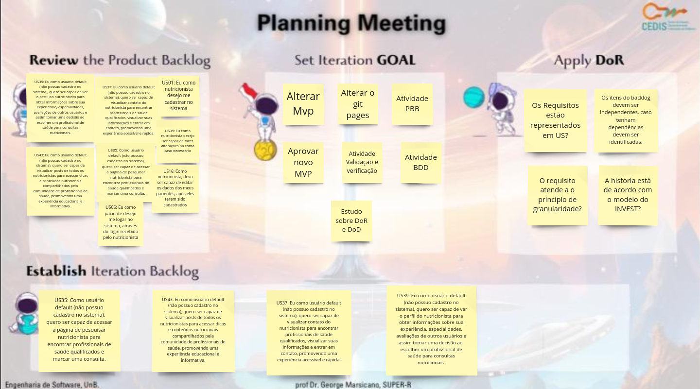
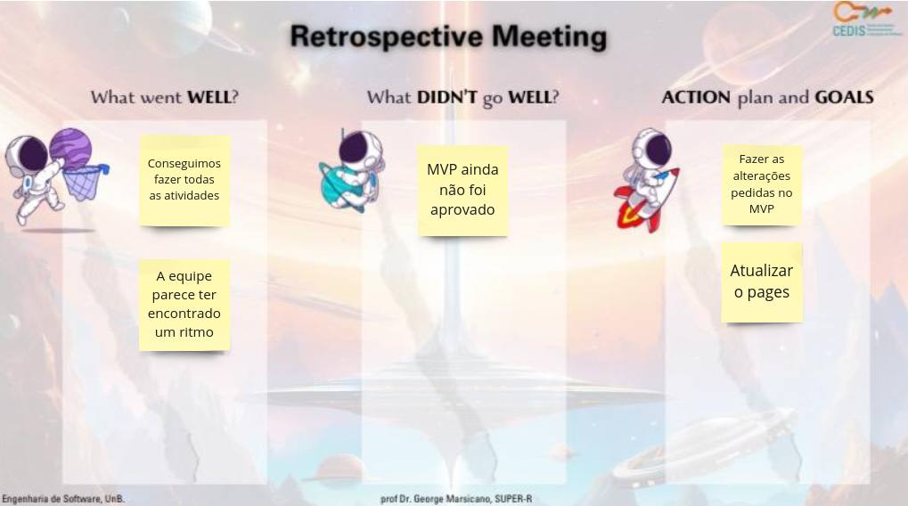
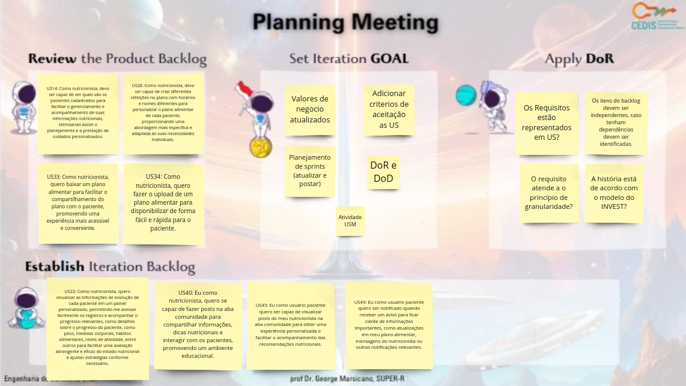
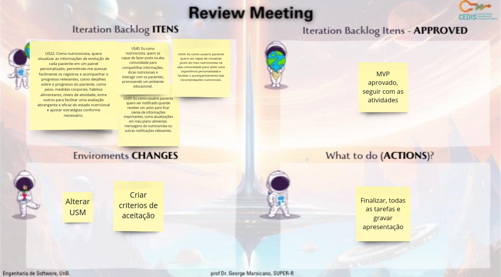

# Documentação das Sprints da missão 3

## Sprints

### **Missão 3 - 31/10 a 23/11**

A tabela 1 apresenta o planejamento da missão 3

_tabela 1_ Planejamento das sprints da missão 3

| Data Início | Sprint  | Data Final |
|-------------|---------|------------|
| 31/10       | Sprint 5| 14/11      |
| 15/11       | Sprint 6| 23/11      |

### Sprint 5

A tabela 2 apresenta o que foi feito na sprint 5

_tabela 2_ Sprint 5

Data: 31/10 a 14/11

| Cerimônia                   | Atividades da Sprint       |
|-----------------------------|---------------------------|
| Sprint Planning             |  Alterar Mvp, Alterar o git pages, Atividade PBB, Aprovar novo MVP, Atividade Validação e verificação, Atividade BDD, Estudo sobre DoR e DoD   |
| Backlog da Sprint           |   US39, US37, US1, US43, US 35, US9, US6, US16  |
| Sprint Review               |   As mudanças foram aprovadas, Atividade de PBB aprovada,  Atividade de BDD aprovada, Retiramos as US de CRUD de usuário e acrescentamos as US de usuário default,  |
| Débitos                     |    MVP ainda não foi aprovado  |
| Sprint Retrospective        |  conseguimos fazer todas as atividades, A equipe parece ter encontrado um ritmo, Atualizar o pages, Fazer as alterações pedidas no MVP |

Fonte: [Eric Camargo](https://github.com/Ericcs10), 2023.

### Dailys da sprint

A tabela 3 apresenta o registros das dailys

_tabela 3_ Dailys realizadas

| Data    | Aluno     | O que foi feito                                         | O que vai ser feito                                      | Bloqueios                                               |
|---------|-----------|---------------------------------------------------------|------------------------------------------------------------|---------------------------------------------------------|
| 31/10   | Luana     | Não mexeu no Projeto | Estudar sobre o PBB    | Outras disciplinas  |
| 31/10   | Henrique  | Não mexeu no Projeto | Estudar sobre o PBB   | Outras disciplinas  |
| 31/10   | Eric      | Não mexeu no Projeto | Estudar sobre o PBB   | Outras disciplinas  |
| 31/10   | Guilherme | Não mexeu no Projeto | Estudar sobre o PBB   | Outras disciplinas  |
| 01/11   | Luana     | Não mexeu no Projeto |  Realizar mudanças no MVP  | Outras disciplinas  |
| 01/11   | Henrique  | Não mexeu no Projeto |  Realizar mudanças no MVP  | Outras disciplinas  |
| 01/11   | Eric      | Não mexeu no Projeto |  Realizar mudanças no MVP  | Outras disciplinas  |
| 01/11   | Guilherme | Não mexeu no Projeto |  Realizar mudanças no MVP  | Outras disciplinas  |
| 06/11   | Luana     | Repriorizou as historias |  Alterar o MVP  | Professor não aprovou a primeira versaõ |
| 06/11   | Henrique  | Repriorizou as historias |  Alterar o MVP  | Professor não aprovou a primeira versaõ |
| 06/11   | Eric      | Não mexeu no Projeto |  Alterar o MVP  | Outras disciplinas |
| 06/11   | Guilherme | Não mexeu no Projeto |  Alterar o MVP  | Outras disciplinas |
| 07/11   | Luana     | Repriorizou as historias |  Alterar o MVP  | Professor não aprovou a primeira versaõ  |
| 07/11   | Henrique  | Não mexeu no Projeto |  Alterar o MVP  | Outras disciplinas |
| 07/11   | Eric      | Repriorizou as historias |  Alterar o MVP  | Professor não aprovou a primeira versaõ |
| 07/11   | Guilherme | Não mexeu no Projeto  |  Alterar o MVP   | Outras disciplinas |
| 08/11   | Luana     | Alterou o MVP |  Aguardar aprovação do professor  | nenhum |
| 08/11   | Henrique  | Alterou o MVP |  Aguardar aprovação do professor  | nenhum |
| 08/11   | Eric      | Alterou o MVP |  Aguardar aprovação do professor  | nenhum |
| 08/11   | Guilherme | Alterou o MVP |  Aguardar aprovação do professor  | nenhum |
| 09/11   | Luana     | Não mexeu no Projeto | Atividade Validação e verificação   | Outras disciplinas |
| 09/11   | Henrique  | Não mexeu no Projeto | Atividade Validação e verificação   | Outras disciplinas |
| 09/11   | Eric      | Não mexeu no Projeto | Atividade Validação e verificação   | Outras disciplinas |
| 09/11   | Guilherme | Não mexeu no Projeto | Atividade Validação e verificação   | Outras disciplinas |
| 10/11   | Luana     | Não mexeu no Projeto |  Estudar sobre o BDD  | Outras disciplinas |
| 10/11   | Henrique  | Não mexeu no Projeto |  Estudar sobre o BDD  | Outras disciplinas |
| 10/11   | Eric      | Não mexeu no Projeto |  Estudar sobre o BDD  | Outras disciplinas |
| 10/11   | Guilherme | Não mexeu no Projeto | Estudar sobre o BDD   | Outras disciplinas |
| 13/11   | Luana     | Ajustou o backlog |  alterar MVP  | Professor não aprovou a nova versão |
| 13/11   | Henrique  | Ajustou o backlog |  alterar MVP  | Professor não aprovou a nova versão |
| 13/11   | Eric      | Ajustou o backlog |  alterar MVP  | Professor não aprovou a nova versão |
| 13/11   | Guilherme | Separou as tarefas | alterar MVP  | Professor não aprovou a nova versão |
| 14/11   | Luana     | Preparou nova versão do MVP |  Fazer atividade USM   |  nenhum  |
| 14/11   | Henrique  | Preparou nova versão do MVP |  Fazer atividade USM     | nenhum   |
| 14/11   | Eric      | Preparou nova versão do MVP |  Fazer atividade USM    | nenhum   |
| 14/11   | Guilherme | Preparou nova versão do MVP |  Fazer atividade USM     | nenhum   |

Fonte: [Eric Camargo](https://github.com/Ericcs10), 2023.

### **Planning Meeting**
 
- Template da planning:

  

### **Review Meeting**

- Template da review:

  

### **Retrospective Meeting**

- Template da retrospective:

  

### Sprint 6

A tabela 4 apresenta o que foi feito na sprint 6

_tabela 4_ Sprint 6

Data: 15/11 a 23/11

| Cerimônia                   | Atividades da Sprint       |
|-----------------------------|---------------------------|
| Sprint Planning             | Valores de negocio atualizar, Adicionar criterios de aceitação as US, Planejamento de sprints (atualizar e postar), DoR e DoD, Atividade USM|
| Backlog da Sprint           |US22, US40, US45, US49 |
| Sprint Review               | MVP aprovado, seguir com as atividades, Alterar USM, Criar criterios de aceitação,  |
| Débitos                     | Não participamos do ponto de controle |
| Sprint Retrospective        | Conseguimos concluir tudo |

Fonte: [Eric Camargo](https://github.com/Ericcs10), 2023.

### Dailys da sprint

A tabela 5 apresenta o registros das dailys

_tabela 5_ Dailys realizadas

| Data    | Aluno     | O que foi feito                                         | O que vai ser feito                                      | Bloqueios                                               |
|---------|-----------|---------------------------------------------------------|------------------------------------------------------------|---------------------------------------------------------|
| 16/11   | Luana     | Revisar a atividade USM | Atualizar os Valores de negocio   |  nenhum  |
| 16/11   | Henrique  | Revisar a atividade USM | Atualizar os Valores de negocio   |  nenhum  |
| 16/11   | Eric      | Revisar a atividade USM | Atualizar os Valores de negocio   |  nenhum  |
| 16/11   | Guilherme | Revisar a atividade USM | Atualizar os Valores de negocio   |  nenhum  |
| 17/11   | Luana     | Adicionar criterios de aceitação as US | Escrever o planejamento de sprints    | nenhum |
| 17/11   | Henrique  | Adicionar criterios de aceitação as US |  Escrever o planejamento de sprints  | nenhum |
| 17/11   | Eric      | Adicionar criterios de aceitação as US |  Escrever o planejamento de sprints  | nenhum |
| 17/11   | Guilherme | Adicionar criterios de aceitação as US |  Escrever o planejamento de sprints  | nenhum |
| 20/11   | Luana     | |    |  |
| 20/11   | Henrique  | |    |  |
| 20/11   | Eric      | |    |  |
| 20/11   | Guilherme | |    |  |
| 21/11   | Luana     | |    |  |
| 21/11   | Henrique  | |    |  |
| 21/11   | Eric      | |    |  |
| 21/11   | Guilherme | |    |  |
| 22/11   | Luana     | |    |  |
| 22/11   | Henrique  | |    |  |
| 22/11   | Eric      | |    |  |
| 22/11   | Guilherme | |    |  |
| 23/11   | Luana     | |    |  |
| 23/11   | Henrique  | |    |  |
| 23/11   | Eric      | |    |  |
| 23/11   | Guilherme | |    |  |

Fonte: [Eric Camargo](https://github.com/Ericcs10), 2023.

### **Planning Meeting**
 
- Template da planning:

  

### **Review Meeting**

- Template da review:

  

### **Retrospective Meeting**

- Template da retrospective:

  

## Histórico de versão

| Versão |    Data    |      Descrição       |  Autor  | Revisor |
| :----: | :--------: | :------------------: | :-----: | :-----: |
|  1.0   | 22/11/2023 | Criação da página | [Henrique](https://github.com/henriqtorresl) |  [Eric](https://github.com/Ericcs10) |
|  1.1   | 22/11/2023 | Descrição missão 1| [Eric](https://github.com/Ericcs10) | [Luana Torres](https://github.com/luanatorress)  |
