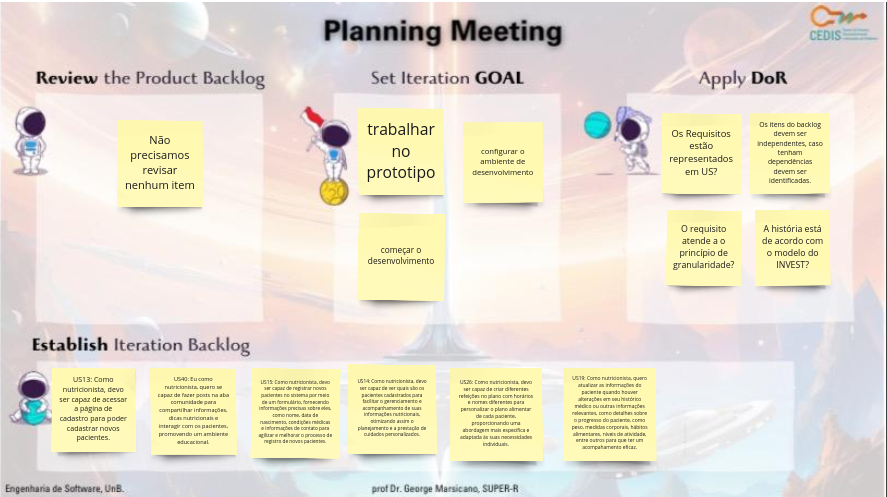
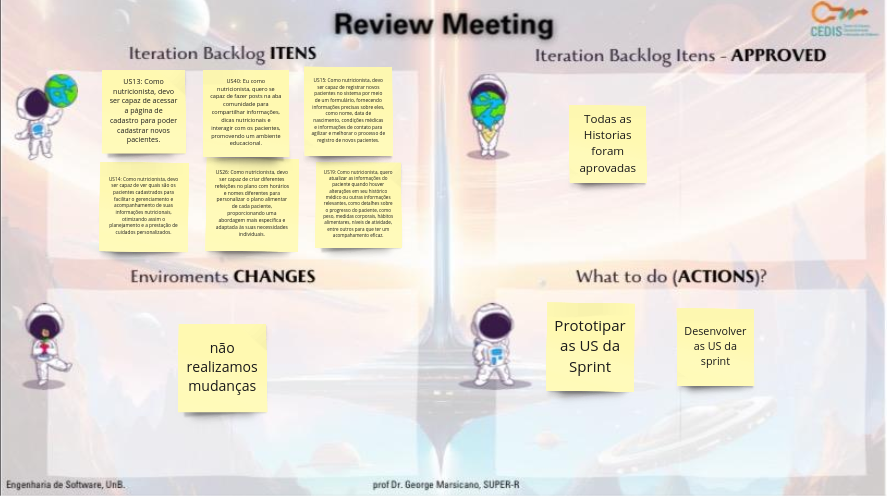
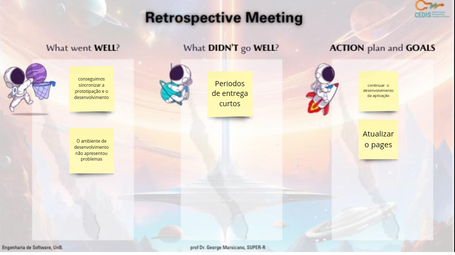
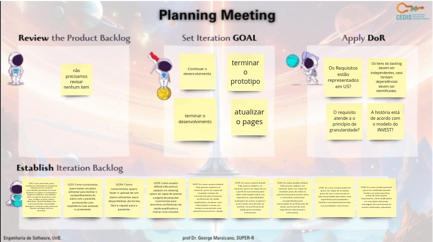
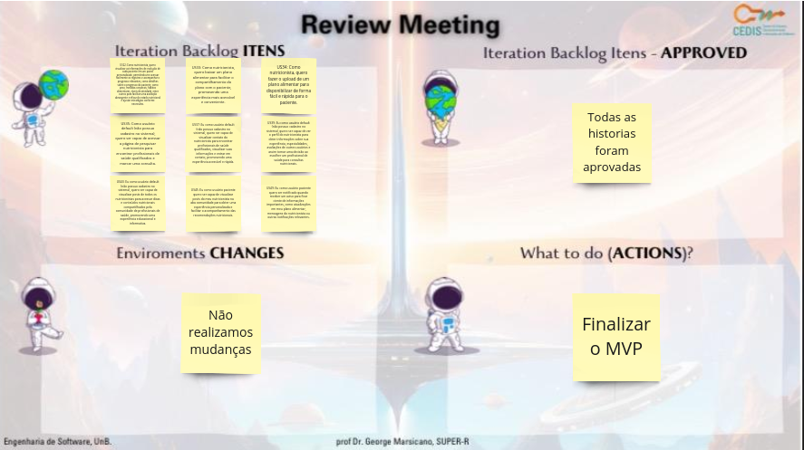
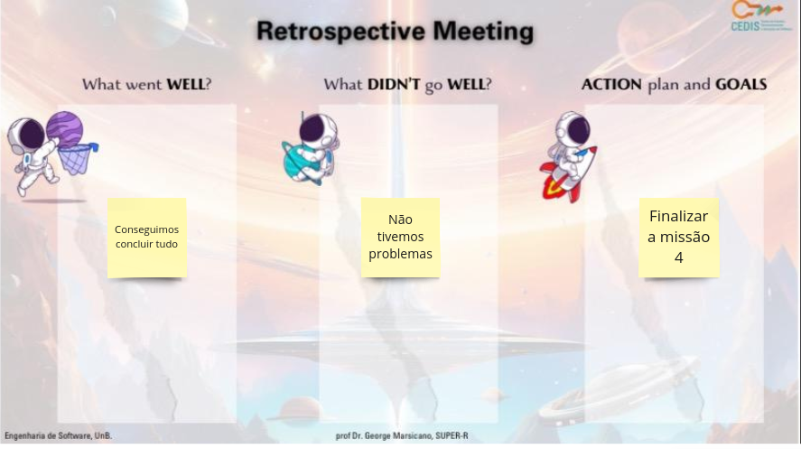

# Documentação das Sprints da missão 4

## Sprints

### **Missão 4 - 23/11 a 12/12**

A tabela 1 apresenta o Planejamento da missão 4

_tabela 1_ Planejamento da missão 1

| Data Início | Sprint  | Data Final |
|-------------|---------|------------|
| 23/11       | Sprint 7| 30/11      |
| 01/12       | Sprint 8| 12/12      |

Fonte: [Eric Camargo](https://github.com/Ericcs10), 2023.

### Sprint 7 

A tabela 2 apresenta o que foi feito na sprint 7

_tabela 2_ Sprint 7

Data: 23/11 a 30/11

| Cerimônia                   | Atividades da Sprint       |
|-----------------------------|---------------------------|
| Sprint Planning             | Iniciar, o desenvolvimento e concluir a prototipação |
| Backlog da Sprint           | US 13, US 40, US 15, US 14, US 26, US 19 |
| Sprint Review               | Não realizamos mudanças no MVP e conseguimos focar apenas em desenvolvimento |
| Débitos                     | Atraso na finaliação do protótipo |
| Sprint Retrospective        | O protótipo deveria ter sido finalizado, o ambiente de desenvolvimento foi corretamente configurado, o desenvolvimento começou bem  |

Fonte: [Eric Camargo](https://github.com/Ericcs10), 2023.

### Dailys da sprint

A tabela 3 apresenta o registros das dailys

_tabela 3_ Dailys realizadas

| Data    | Aluno     | O que foi feito                                         | O que vai ser feito                                      | Bloqueios                                               |
|---------|-----------|---------------------------------------------------------|------------------------------------------------------------|---------------------------------------------------------|
| 24/11   | Luana     | Mexeu no protótipo |  Atualização do protótipo  | Nenhum |
| 24/11   | Henrique  | Começou a configurar ambiente de desenvolvimento |  Finalizar a configuração do ambiente de desenvolvimento  | Nenhum |
| 24/11   | Eric      | Mexeu no protótipo | Atualização do protótipo   | Nenhum |
| 24/11   | Guilherme | Modelagem do banco de dados | trabalhar no banco   | Nenhum |
| 27/11   | Luana     | Mexeu no protótipo | Atualização do protótipo   | Nenhum |
| 27/11   | Henrique  | Configurou ambiente de desenvolvimento |  Começar a desenvolver   | Nenhum |
| 27/11   | Eric      | Mexeu no protótipo | Atualização do protótipo   | Nenhum |
| 27/11   | Guilherme | Modelagem do banco de dados | trabalhar no banco   | Nenhum |
| 28/11   | Luana     | Mexeu no protótipo | Atualização do protótipo   | Nenhum |
| 28/11   | Henrique  | Começou o desenvolvimento |  focar no desenvolvimento   | Nenhum |
| 28/11   | Eric      | Mexeu no protótipo |  Atualização do protótipo  | Nenhum |
| 28/11   | Guilherme | Modelagem do banco de dados | trabalhar no banco   | Nenhum |
| 29/11   | Luana     | Mexeu no protótipo | Finalizar o protótipo   | Nenhum |
| 29/11   | Henrique  | Continuou o desenvolvimento |  focar no desenvolvimento  | Nenhum |
| 29/11   | Eric      | Mexeu no protótipo | Finalizar o protótipo   | Nenhum |
| 29/11   | Guilherme | Modelagem do banco de dados |  trabalhar no banco  | Nenhum |

Fonte: [Eric Camargo](https://github.com/Ericcs10), 2023.

### **Planning Meeting**
 
- Template da planning:

  

### **Review Meeting**

- Template da review:

  

### **Retrospective Meeting**

- Template da retrospective:

  

### Sprint 8 

A tabela 4 apresenta o que foi feito na sprint 8

_tabela 4_ Sprint 8

Data: 01/12 a 12/12

| Cerimônia                   | Atividades da Sprint       |
|-----------------------------|---------------------------|
| Sprint Planning             | Seguir o desenvolvimento e concluir a prototipação, finalizar o desenvolvimento e focar em ajustes |
| Backlog da Sprint           | US 22, US 33, US 34, US 35, US 37, US 39, US 43, US 45, US 49 |
| Sprint Review               | Protótipo finalizado, foco em desenvolvimento, finalização e ajustes |
| Débitos                     | Não notamos debitos |
| Sprint Retrospective        | A aplicação ja está funcionando e está nos ultimos ajustes  |

Fonte: [Eric Camargo](https://github.com/Ericcs10), 2023.

### Dailys da sprint

A tabela 3 apresenta o registros das dailys

_tabela 3_ Dailys realizadas

| Data    | Aluno     | O que foi feito                                         | O que vai ser feito                                      | Bloqueios                                               |
|---------|-----------|---------------------------------------------------------|------------------------------------------------------------|---------------------------------------------------------|
| 04/12   | Luana     | Finalizou o protótipo | Ajustar conforme feedback   | Nenhum |
| 04/12   | Henrique  | Continuou o desenvolvimento | foco no desenvolvimento   | Nenhum |
| 04/12   | Guilherme | Modelando Banco de dados |  Finalizar a parte do banco  | Nenhum |
| 04/12   | Eric      | Finalizou o protótipo | Ajustar conforme feedback | Nenhum |
| 05/12   | Luana     | Ajustes no protótipo | Auxiliar no desenvolvimento   | Outras disciplinas |
| 05/12   | Henrique  | Continuou o desenvolvimento | foco no desenvolvimento   | Nenhum |
| 05/12   | Eric      | Ajustes no protótipo | Auxiliar nos testes da aplicação   | Outras disciplinas |
| 05/12   | Guilherme | Finalizou a parte do banco de dados | Auxiliar nos testes da aplicação   | Nenhum |
| 06/12   | Luana     | Ajudou no desenvolvimento | Auxiliar no desenvolvimento  | Outras disciplinas |
| 06/12   | Henrique  | Continuou o desenvolvimento | foco no desenvolvimento   | Nenhum |
| 06/12   | Eric      | Ajudou no desenvolvimento |  Auxiliar nos testes da aplicação   | Nenhum |
| 06/12   | Guilherme | testou a aplicação | Auxiliar nos testes da aplicação   | Outras disciplinas |
| 07/12   | Luana     | Ajudou no desenvolvimento | foco no desenvolvimento   | Nenhum |
| 07/12   | Henrique  | Continuou o desenvolvimento | Fazer ajustes na aplicação   | Nenhum |
| 07/12   | Eric      | testou a aplicação |  Ajudar nos testes da aplicação  | Outras disciplinas |
| 07/12   | Guilherme | testou a aplicação  |  Ajudar nos testes da aplicação  | Nenhum |
| 08/12   | Luana     | testou a aplicação | Organizar a documentação   | Nenhum |
| 08/12   | Henrique  | Continuou o desenvolvimento | foco no desenvolvimento   | Nenhum |
| 08/12   | Eric      | Ajudou no desenvolvimento | Organizar a documentação   | Outras disciplinas |
| 08/12   | Guilherme | testou a aplicação  | Organizar a documentaçãoo   | Nenhum |
| 11/12   | Luana     | Organizou ajustes no pages  | Entrega da Missão | Outras disciplinas |
| 11/12   | Henrique  | Finalizou o desenvolvimento | Entrega da Missão  | Nenhum |
| 11/12   | Eric      | Organizou ajustes no pages  | Entrega da Missão   | Nenhum |
| 11/12   | Guilherme | Organizou ajustes no pages  | Entrega da Missão   | Nenhum |

Fonte: [Eric Camargo](https://github.com/Ericcs10), 2023.

### **Planning Meeting**
 
- Template da planning:

  

### **Review Meeting**

- Template da review:

  

### **Retrospective Meeting**

- Template da retrospective:

  

## Histórico de Versão

| Versão |    Data    |      Descrição       |  Autor  | Revisor |
| :----: | :--------: | :------------------: | :-----: | :-----: |
|  1.0   | 11/12/2023 | Criação da página | [Eric](https://github.com/Ericcs10) |   |
|  1.1   | 11/12/2023 | Descrição missão 4| [Eric](https://github.com/Ericcs10) | [Luana Torres](https://github.com/luanatorress)  |
|  1.1   | 11/12/2023 | Adicionando os Templates | [Luana Torres](https://github.com/luanatorress), [Eric](https://github.com/Ericcs10) | [Luana Torres](https://github.com/luanatorress)  |