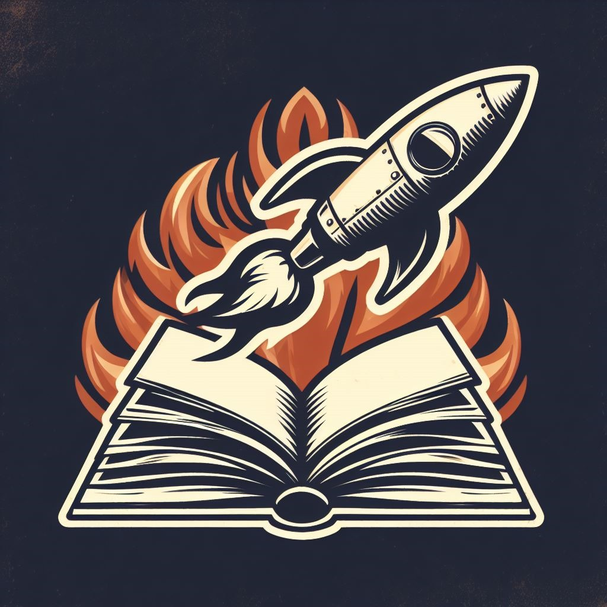

# História da Facção

  

Há muitos anos, em um sistema solar distante, um grupo de aventureiros intrépidos decidiu unir forças para explorar as profundezas do espaço e desvendar seus mistérios mais profundos. Eles se autodenominaram “Os Skywalkers”, em homenagem à coragem necessária para caminhar pelos céus estelares desconhecidos.

A história começa com Draven Thornheart, um engenheiro espacial talentoso que sonhava em fazer uma diferença no universo. Ele viu a oportunidade de criar uma equipe de exploradores espaciais que combinassem suas habilidades técnicas com o desejo de desvendar os segredos do cosmos.

Juntamente com John Pedes “6”, um misterioso mensageiro que se tornou um dos fundadores do grupo, eles começaram a recrutar membros para os Skywalkers. Ninguém sabia muito sobre John, exceto que ele havia retornado inesperadamente após um ataque que quase destruiu o grupo. Sua missão era reencontrar antigos membros e descobrir a verdade por trás do ataque.

Arthreides Skywalker, o último descendente de uma nobre linhagem do planeta Helennium, uniu-se à equipe com sua habilidade de resolver problemas e seu desejo de catalogar os segredos da galáxia. Seu nome era uma homenagem a um lendário messias e seu sobrenome foi adotado quando ele se juntou aos Skywalkers.

Stellar, uma jovem que desafiou o destino imposto por sua família influente ao fugir de um casamento arranjado, encontrou nos Skywalkers a oportunidade de seguir seu próprio caminho e contribuir para a exploração do universo, mesmo mantendo sua identidade em segredo.

Por fim, Henrion, com sua inteligência afiada e coragem inabalável, completou o grupo. Ele era determinado a seguir os passos de sua família e catalogar os segredos do cosmos.

Unidos pela sede de conhecimento, coragem e um desejo profundo de desbravar o espaço, os Skywalkers tornaram-se uma facção espacial de exploradores destemidos. Sua missão: desvendar os mistérios intergalácticos, proteger a galáxia de ameaças desconhecidas e catalogar cada descoberta para o benefício de toda a humanidade. Com uma equipe diversificada e talentosa, os Skywalkers embarcaram em uma jornada épica através das estrelas, determinados a deixar sua marca no vasto cosmos.

## Histórias Individuais

**Draven Thornheart** - Cresceu em um mundo onde a tecnologia e a exploração espacial eram parte integrante da vida. Seu pai, um engenheiro de renome que trabalhava na construção de naves espaciais, e sua mãe, uma cientista planetária, deixaram uma forte influência em sua vida desde cedo. Draven herdou a paixão pelo conhecimento técnico de seu pai e o espírito aventureiro de sua mãe.
Determinado a seguir os passos de seus pais, Draven se tornou um engenheiro espacial e se juntou à equipe Estelar, uma equipe de aventureiros espaciais famosa por desvendar os segredos do cosmos. Ao longo de suas jornadas, ele ganhou reconhecimento por sua habilidade em reparar naves avariadas em meio ao vácuo do espaço e desenvolver tecnologia avançada para facilitar a exploração intergaláctica. Carregando o legado de sua família, Draven está constantemente em busca de desafios técnicos e da próxima fronteira a ser explorada. Seu desejo é não apenas avançar os limites da tecnologia espacial, mas também desvendar os mistérios do universo, enquanto constrói pontes entre o conhecimento científico e a engenharia espacial. A história de Draven Thornheart é uma jornada de coragem, engenhosidade e dedicação à exploração do espaço sideral.

Autor: <a href="https://github.com/Ericcs10">Eric Camargo</a>

**John Pedes "6"** - Diz ser um dos Fundadores do grupo e único deles que sobreviveu o ataque, ninguém tem certeza se é verdade já que ele nunca mostra a cara e prefere que chamem ele pelo o seu apelido antigo: 6, as únicas que sabem dele é que antes de se tronar um dos fundadores do Skywalkers ele era um mensageiro qualquer, mas sua experiência em várias areas gera duvida sobre isso, graças a isso existe vários rumores sobre ele, do nada ele voltou e tentou trazer o grupo de volta, procurando achar outros membros e saber mais sobre o porque e como do ataque.

Autor: <a href="https://github.com/GG555-13">Guilherme de Oliveira</a>

**Arthreides Skywalker** - Último descendente de uma das famílias pertencentes à classe nobre do planeta Helennium. Seu pai é um soldado poderosíssimo que já venceu inúmeras batalhas espaciais e sua mãe é um computador humano, devido à extrema capacidade intelectual para resolver problemas. Devido a isso, AS está pronto para resolver qualquer tipo de situação nas mais diversas ocasiões. Com o intuito de colocar suas habilidades à prova, se juntou aos Skywalkers em busca de aventuras e para desvendar os segredos e mistérios da galáxia e catalogá-los. Seu nome é em homenagem a um Messias e seu sobrenome foi ganho ao ingressar na facção.

Autor: <a href="https://github.com/arthur-heleno">Arthur Heleno</a>

**Stellar** - filha de uma das famílias mais influentes do conglomerado, foi forçada a casar se por interesse mútuo entre os conglomerados mas fugiu no dia do casamento. Uniu-se aos SKY walkers por ter ideias parecidos aos deles, mantendo a identidade dos pais mesmo não concordando com seus princípios

Autor: <a href="https://github.com/luanatorress">Luana Souza</a>

**Henrion** - Henrion cresceu imerso em uma atmosfera de conhecimento e aventura. Ele herdou a inteligência aguçada de sua mãe e a coragem de seu pai. Para desafiar a si mesmo e explorar os segredos da galáxia, Henrion juntou-se aos Skywalkers, uma renomada equipe de aventureiros e exploradores espaciais, na busca por aventuras e mistérios intergalácticos. Henrion é conhecido por sua habilidade em resolver problemas complexos e enfrentar desafios com coragem e inteligência, enquanto carrega consigo o legado de sua família e o desejo de catalogar os segredos do cosmos.

Autor: <a href="https://github.com/henriqtorresl">Henrique Torres</a>

## Histórico de versão

| Versão |    Data    |      Descrição       |  Autor  | Revisor |
| :----: | :--------: | :------------------: | :-----: | :-----: |
|  0.1   | 25/10/2023 | Adicionando a história da facção e dos participantes | [Eric](https://github.com/Ericcs10) | [Henrique](https://github.com/henriqtorresl)  |