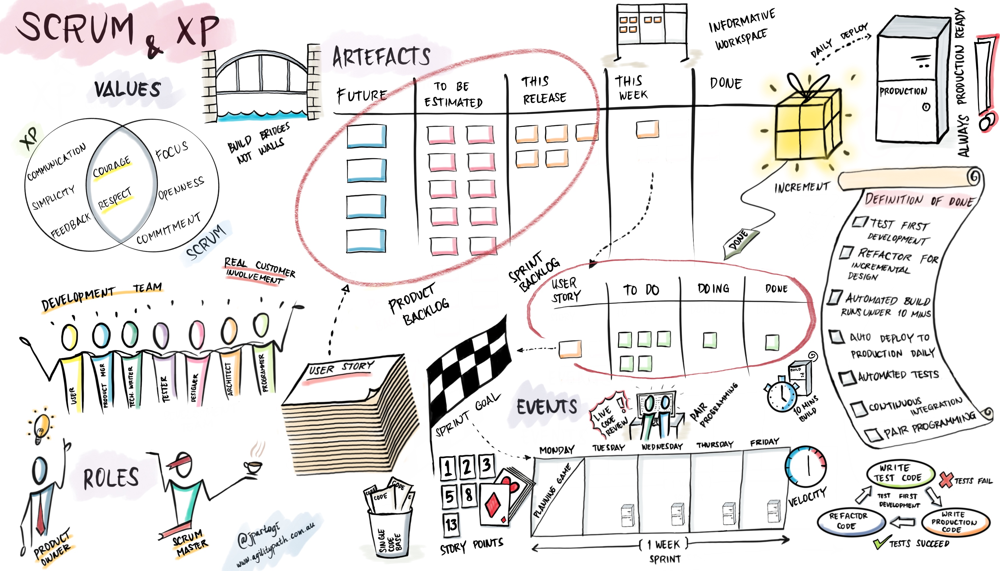

# Processo de Desenvolvimento de Software

Gupta (2008)[1] propõe que a escolha da abordagem de desenvolvimento de software deve ser baseada em critérios como as necessidades e requisitos do projeto, o ambiente e cultura organizacional em que o projeto será executado, o tamanho e complexidade do projeto, o risco envolvido, o orçamento e o prazo para conclusão do projeto. Ele enfatiza que a escolha da abordagem não é uma decisão única e estática, mas sim um processo contínuo que deve ser revisado e adaptado ao longo do tempo para garantir o sucesso do projeto.

### Características dos Requisitos

| Requisitos | Cascata | Prototipação | Iterativo e Incremental | Evolutivo | Spiral | RAD |
|:---|:---:|:---:|:---:|:---:|:---:|:---:|
|Os requisitos são facilmente compreensíveis e definidos? (SIM)| Sim | Não | Não | Não | Não | Sim |
|Mudamos os requisitos com bastante frequência? (NÃO)| Sim | Não | Sim | Sim | Não | Sim |
|Podemos mudar os requisitos no início do ciclo? (SIM)| Sim | Não | Sim | Sim | Não  | Sim |
|Os requisitos indicam um sistema complexo a ser construído? (NÃO)| Sim | Não | Não | Não | Não | Sim |

### Status da Equipe de Desenvolvimento

|Requisitos | Cascata | Prototipação | Iterativo e Incremental | Evolutivo | Spiral | RAD |
|:---|:---:|:---:|:---:|:---:|:---:|:---:|
|Menos experiência em projetos similares(SIM) | Não | Sim | Não | Não | Sim | Não |
|Menos conhecimento de domínio (novidade na tecnologia) (NÃO) | Não | Sim | Não | Não | Não | Sim |
|Menos experiência nas ferramentas a serem utilizadas (SIM) | Não | Sim | Sim | Sim | Não | Sim |
|Disponibilidade de treinamento, se necessário(SIM) | Não | Não | Sim | Sim | Não | Sim |

### Envolvimento do Usuário

|Requisitos | Cascata | Prototipação | Iterativo e Incremental | Evolutivo | Spiral | RAD |
|:---|:---:|:---:|:---:|:---:|:---:|:---:|
|Envolvimento do usuário em todas as fases (NÃO) | Sim | Não | Sim | Sim | Sim | Não |
|Participação limitada do usuário(SIM) | Sim | Não | Sim | Sim | Sim | Não |
|O usuário não tem experiência prévia de participação em projeto semelhante(NÃO)| Não | Sim | Sim | Sim | Sim | Não |
|Os usuários são especialistas no domínio do problema (NÃO) | Sim | Não | Não | Sim | Sim | Não |

### Tipo de Projeto e Risco Associado

|Requisitos | Cascata | Prototipação | Iterativo e Incremental | Evolutivo | Spiral | RAD |
|:---|:---:|:---:|:---:|:---:|:---:|:---:|
|O projeto é aprimoramento do sistema existente (NÃO)| Sim | Sim | Não | Não | Sim | Não |
|O financiamento é estável para o projeto(SIM)| Sim | Sim | Não | Não | Não | Sim |
|Altos requisitos de confiabilidade(SIM)| Não | Não | Sim | Sim | Sim  | Não |
|Cronograma do projeto apertado(SIM)| Não | Sim | Sim | Sim | Sim | Sim |
|Uso de componentes reutilizáveis(NÃO)| Sim | Não | Sim | Sim | Não | Não |
|Os recursos (tempo, dinheiro, pessoas etc.) são escassos?(SIM)| Não | Sim | Não | Não | Sim | Não |

## Facetas

As Facetas do processo de Engenharia de Requisitos são encontradas no IREB (2022)[2], e serve para poder identificar quais são as características dos requisitos do projeto, na figura 1, observa-se a estrutura do diagrama e quais pontos devem ser levados em consideração.

Figura 1 - Facetas do processo de ER (Fonte: International Requirements Engineering Board, 2022)

Através de uma análise cuidadosa, a equipe chegou na conclusão que as características do projeto se encaixam na seguinte descrição 

### Market-Oriented

O nosso software é desenvolvido como um produto ou serviço para um mercado, com base nos seguintes critérios de seleção: 
- O nosso produto tem como alvo nutricionistas; 
- Os requisitos são especificados pelo fornecedor(Grupo); 
- O fornecedor tem que adivinhar/estimar/eliminar as necessidades dos clientes/usuários previstos; 

### Iterativo

- Requisitos em evolução - não conhecidos antecipadamente;
- Curtos ciclos de feedback estabelecidos para mitigar o risco;
- Longa duração do projeto;
- A capacidade de alterar os requisitos facilmente é importante;

### Explorátorio

Apenas objetivos conhecidos, os requisitos concretos devem ser explorados.
- Partes interessadas fortemente envolvidas, feedback contínuo; 
- Prazos e custos restringem os requisitos; 
- Priorizar e negociar os requisitos a serem implementados.

Quanto ao processo de Engenharia de Requisitos, foi optado por orientado a produto, iterativo exploratório e orientado a mercado. O motivo da escolha é o objetivo de garantir que o produto ofereça um melhor valor de mercado e experiencia de usuário, que são aspectos importantes para o produto proposto. A forma incremental do desenvolvimento também ajuda em criar um produto mais flexível para mudanças baseadas no feedback dos clientes, além de permitir uma maior continuidade no desenvolvimento do produto e permitir maior flexibilidade no desenvolvimento e nos requisitos.

## ScrumXP

Levando em consideração o resultado do GUPTA e as características das Facetas do Processo de Engenharia de Requisitos que se enquadram no projeto e comentários do professor na apresentação, foi decidido que nosso grupo vai usar o ScrumXP para trabalhar ao longo do desenvolvimento. 

O ScrumXP é um método de equipe ágil usado por Agile Release Trains (ARTs) para planejar, executar, retrospectar e entregar valor ao cliente em um curto espaço de tempo. Ele combina o poder do Scrum com as práticas do Extreme Programming (XP). Muitas equipes usam o SAFe ScrumXP como seu principal processo de equipe ágil. 

As equipes ágeis que aplicam o SAFe ScrumXP seguem uma cadência regular de eventos para alcançar um objetivo comum, entregando valor à empresa e aos seus clientes. As equipes têm autoridade e autonomia para planejar, executar e gerenciar seu trabalho, tomar decisões dentro de seu escopo e se adaptar às condições em constante mudança da melhor maneira que acharem adequada. As equipes determinam como fazem seu trabalho e o escopo a que podem se comprometer dentro do prazo. Elas criam e refinam itens do backlog, geralmente expressos como histórias com critérios de aceitação, definindo e comprometendo-se com metas de iteração. Em seguida, elas constroem, testam e implantam a nova funcionalidade e garantem a qualidade incorporada para cada incremento da solução.

Figura 2 - SAFe ScrumXP (Fonte: [scrum.org](https://www.scrum.org/resources/blog/scrum-and-extreme-programming-xp))

## Processo de Engenharia de Requisitos

### Elicitação e Descoberta

- Entrevistas com cliente, questionários com cliente e prototipagem rápida(baixa fidelidade) com o cliente, observação mais na frente, revisão de documentos
- **Ferramentas**: Microsoft Teams, Discord, Google Forms e Google Docs

### Análise e Consenso

- **levantamento inicial de requisitos**: participação de todas as partes interessadas através das entrevistas e dos questionários coletados.
- **documentação de requisitos**: os requisitos levantados deram documentados através do backlog na estrutura do SAFE e lista de Requisitos. 
- **análise de requisitos**: para verificar se os requisitos levantados inicialmente atendem às necessidades, se estão alinhados com o projeto e se não são contraditórios.
- **priorização de requisitos**: priorização através da análise de critérios como complexidade e valor de negócio; pode-se utilizar a técnica MosCow juntamente à esta análise.
- **validação**: a partir de checklist e walkthroughs entre a equipe e representantes do público-alvo.
- **documentação de mudanças**: será criado um histórico de versão dos requisitos caso haja necessidade de mudança em algum requisito
- **obtenção de consenso**: será obtido através das entrevistas e feedback.
- **validação técnica**: protótipo de alta fidelidade (Figma) com o representante-cliente, github (declarar a visão do produto), reuniões entre integrantes
- **Ferramentas**: Trello, Figma, Discord, Microsoft Teams, Github, Google Forms e LucidChart

### Declaração

- Serão definidos todos os requisitos funcionais e não funcionais nessa etapa
- **Requisitos funcionais**: listagem e backlog na estrutura do SAFE.
- **Requisitos não funcionais**: serão listados e documentados.
- **Requisitos de interface**: apresentação de prototipagem simples em papel para descrever o sistema
- **Restrições e limitações**: serão listadas e documentadas, todas as partes interessadas serão avisadas
- **Métodos de validação**: através de questionários e disponibilização das documentações para obtermos opiniões sobre o andamento dessa etapa
- **Aprovação**: após coletadas as opniões a partir dos questionários on-line
- **Ferramentas**: Trello, Discord, Microsoft Teams, Github, Google Forms e LucidChart

### Representação

- documentação e protótipos de alta e baixa fidelidade (figma e papel)
- **Ferramentas**: Figma e Papel

### Verificação e Validação

- checklists, ferramentas de teste e análise estática, e entrevistas com o cliente e observação do cliente usando funções do produto
- **Ferramentas**: Trello, Figma, Discord, Microsoft Teams, Github e Google Forms

### Organização e Atualização

- github, reuniões entre integrantes, ferramentas de fluxo (trello)
- **Ferramentas**: Github e Trello

## Referências Bibliográficas

> 1. GUPTA, S. Managing Iterative Software Development Projects. Auerbach Publications, 2008. 
> 2. INTERNATIONAL REQUIREMENTS ENGINEERING BOARD. Handbook IREB CPRE Foundation Level, Version 1.1.0, september 2022. [S.l.]: International Requirements Engineering Board, 2022. 

| Versão |    Data    |      Descrição       |  Autor  | Revisor |
| :----: | :--------: | :------------------: | :-----: | :-----: |
|  0.1   | 24/10/2023 | Criação do documento | Arthur | Guilherme  |
|  0.2   | 25/10/2023 | Revisando o arquivo conforme o feedback do professor | Guilherme |  Luana |
|  0.3   | 26/10/2023 | Revisando o arquivo conforme a missão 2 | Luana | Eric |
